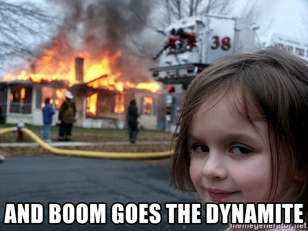

theme: Zurich, 3

# Learning Through Failure

Rich Burroughs
Community Manager
Gremlin, Inc.
@richburroughs

---

^I started off in the industry in the mid 90s, in beautiful Portland, Oregon, working for an Internet Provider

---

^Was in oncall rotations for about 20 years of my career
Have a bit of what's called the housand yard stare

---

#Complexity is constantly increasing

^Virtualization
Microservices
Cloud
Containers
Kubernetes
Service meshes

---

^My next job was at a site you might have spent some panicked moments on
Very high traffic site on the Internet
Taking out Super Bowl Ads

---

^This is what the front end architecture looked like
Load balancer, 3 big web servers, database and things on the backend
Before horizontal scaling
Used to deploy the site
Take one server out of farm, run scripts, put it back in service

---

^This is an image of the Netflix microservices architecture
It's not even current, so if anything things are more complex

---

#What's changed?

^Complexity has gone up orders of magnitude
All this complexity makes it harder to learn about systems
Also harder to know what's changed

---

^Let's talk about failure

---

^How Complex Systems Fail by Richard Cook
^18 points, here are a few

---

#"Catastrophe is always just around the corner"
^When I started in the industry people thought they could engineer their way out of failure
"We'll have redundant everything and we'll never go down"
But failure is inevitable
As Michael said yesterday we want to have a failure mindset

---

#"Change introduces new forms of failure"

^He's talking here about adopting new technologies
New technologies have new failure modes
They may be even worse failure modes than the ones you used before

---

#"All practitioner actions are gambles"

^Here he's talking about uncertainty
None of us have perfect knowledge of the systems
When your pager wakes you up at 3AM and you're groggy headed you have the alert message and some other things to go on but you're gambling, like a poker player
"Successful outcomes are also the results of gambles"
Several of the points he makes in the paper mention people

---

^People are an important part of systems
^People specialize and have different areas of expertise

---

^We all have our own mental models of the system
^The models come from our experience and knowlege
^Example: network engineer

---

#What are some ways we can learn more about systems?

---

^External docs for open source and proprietary software
Internal docs like Wikis
Wikis get stale
What you drew on the white board may not really be how the system works

---

^Using learning tools
Logan's talk Optimizing Through Learning
Studying systems with tools like flash cards

---

^D&D for SRE
Gamemaster with scenarios, rolled dice
Practiced responding to the system but also the incident response process itself

---

#Chaos Engineering

---

##"The science of performing intentional experimentation on a system by injecting precise and measured amounts of harm to observe how the system responds for the purpose of improving the system’s resilience."

^Injecting failure
Observing how the system responds
Improving resilience

---

^Created in 2010 for move into AWS
Shut down random hosts
Netflix has built other tools and contributed a lot to the community
Amazon and Google had both done failure testing
When I think of those 3 companies I think of resilient systems

---

#Prerequisites
- Observability
- Blameless Culture

^logging, monitoring, alerting and metrics
^How we see what is happening with the system
^People need to feel like they won't get fired for making a mistake

---

#Scientific Method
- Ask a question
- Research
- Form a hypothesis
- Experiment to test the hypothesis
- Analyze data and draw a conclusion
- Share the results

^Sharing externally, or at least internally
^At least everyone working on the system and stakeholders

---

#Types of attacks
- Shutdown
- CPU
- Memory
- I/O
- Network Latency
- Packet Loss
- DNS
- Blackhole

^Types of attacks or failures

---

^Blast radius
The service or application, and what the impact to users is
Number of hosts or containers (1 or 1000 hosts)
Environment (production or staging)

---

#The goal is to experiment in Production

^No other environment will be exactly like it
^Production environments have higher traffic and more data
^Things may be misconfigured in production
^But keep in mind blast radius
^Start in the environment most like production (probably staging)
^As Michael mentioned yesterday, depending on your industry you might not be able to do this, and that's ok

---

^Abort conditions - what would cause us to stop the experiment?
^Increase in error rate or latency, moving towards an SLO violation
^Big red button

---

#Example experiment

- Application: Front End
- Attack: CPU
- Hypothesis: Adding CPU load will cause additional hosts to spin up in our Autoscaling Group
- Abort condition: Latency increases by 20%

---

#Example experiment #2

- Application: Front End
- Attack: Blackhole
- Hypothesis: Blackholing the hostname for the Twilio API will cause the SMS transmissions to time out
- Abort condition: Error rate increases by 20%

---

#Don't experiment on things you know are broken

^Make them resilient first
This relates to what Michael was talking about with everything being on fire

---

#Game Days

^Team gets together to run experiments
People across disciplines
This is how we broaden our mental models
Looking at how the system works vs what's on the white board
Ross mentioned yesterday openness, collaboration and fun
Onboarding

---

#Questions
- Were we able to measure the results?
- Did the system respond the way we expected?
- Are there things we need to fix?

---

#Run experiments to simulate an incident you've had

^Say you have an incident with network latency
Have a Game Day and inject latency
Remidiate and then have another Game Day to see if it worked

---

#What comes after Game Days?

---

#Continuous Chaos

^Run experiments in CI/CD pipeline
We still do Game Days
Chaos tools need an API or some other way to kick them off

---

#Maturity model
- Running manual experiments
- Running experiments using Chaos Engineering tools
- Regularly scheduled Game Days
- Experimenting in Production
- Continuous Chaos

---

#Next steps:

- Join our Chaos Engineering Slack: gremlin.com/slack
- Read tutorials: gremlin.com/community
- Chaos Conf: chaosconf.io
- Gremlin Free: go.gremlin.com/richchaos

---

#Thank you!

Twitter: @richburroughs
Email: richb@gremlin.com

#Slides: https://github.com/richburroughs/dojo201904

^Thanks, hope you've learned a lot about how systems have changed.
^We're all on this journey together so let's be friends and help each other

