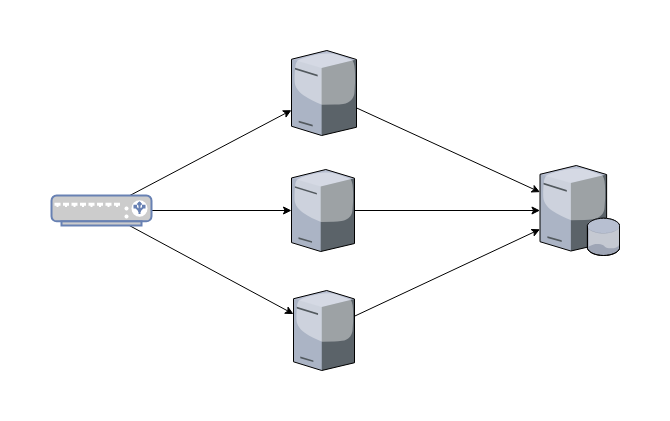
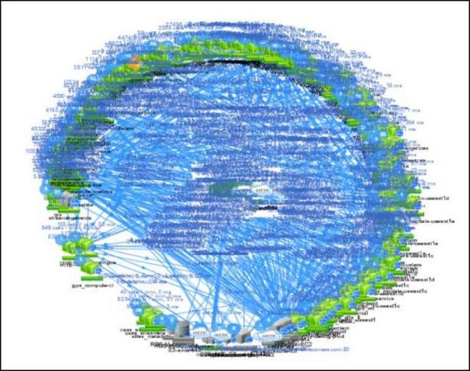
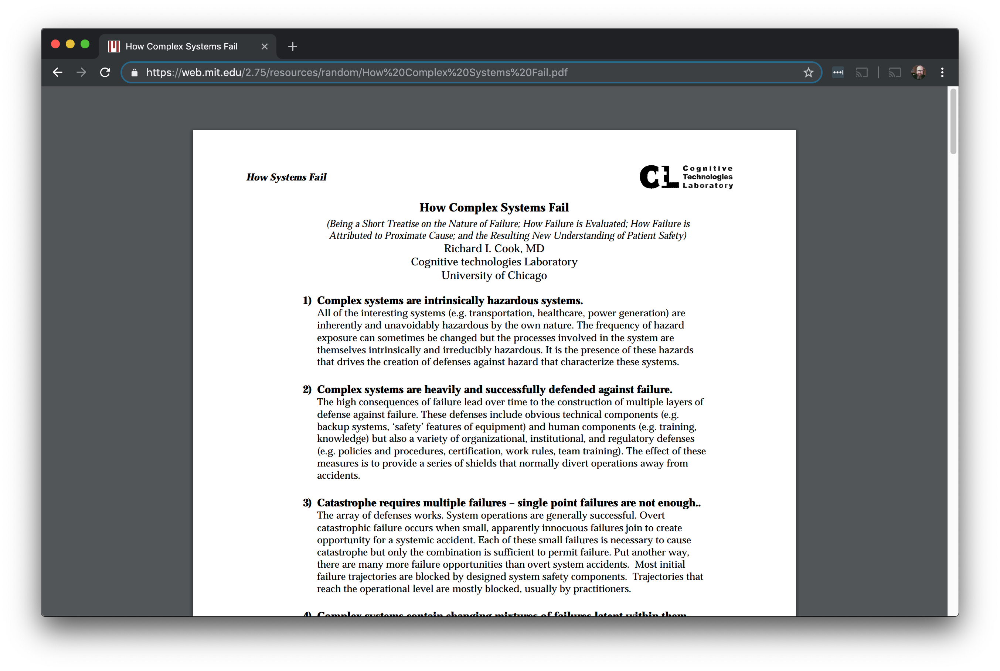
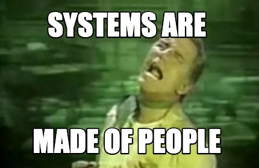
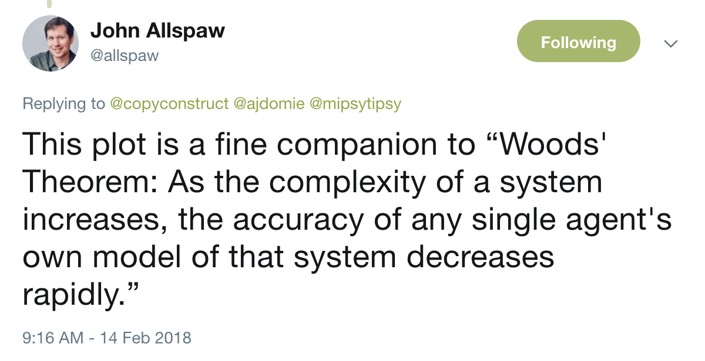
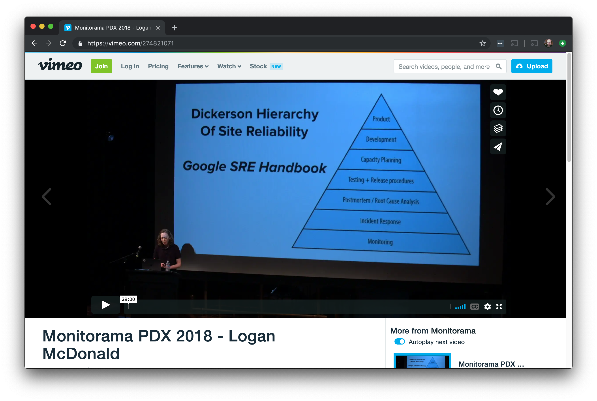
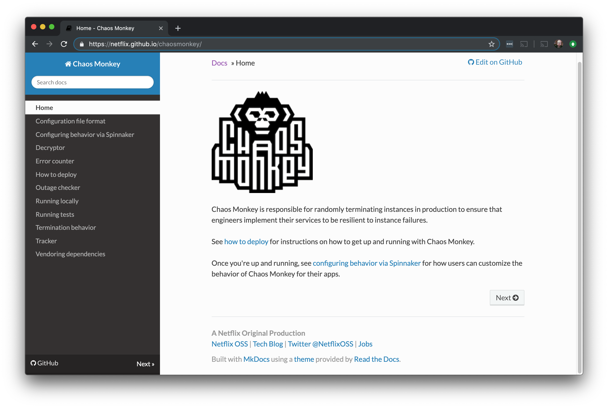
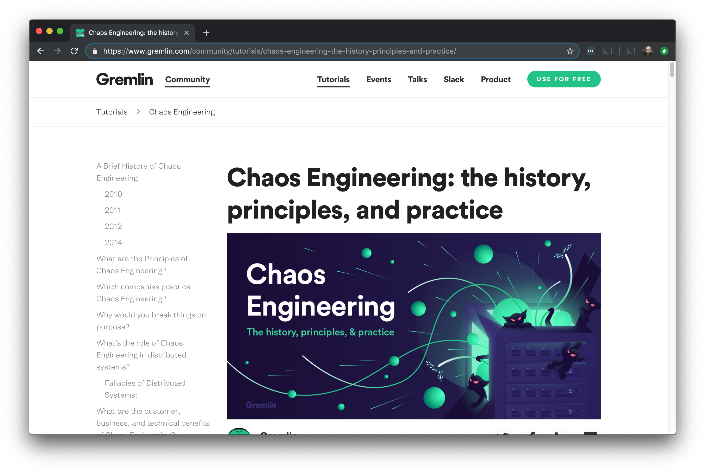
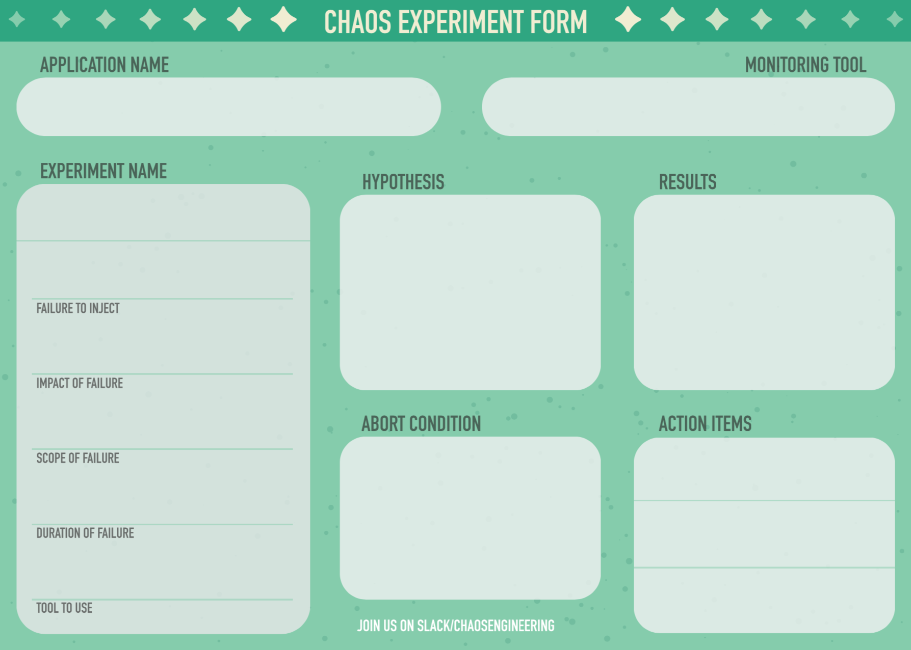
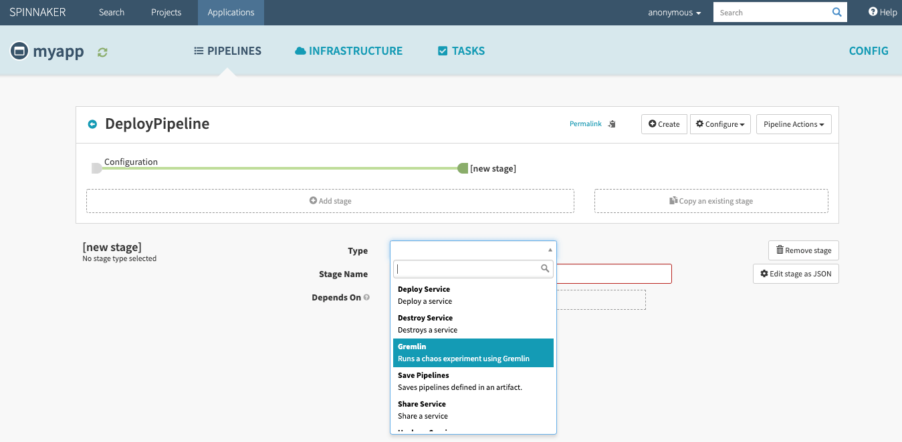

theme: Zurich, 3

# Learning Through Failure

Rich Burroughs
Community Manager
Gremlin, Inc.
@richburroughs

---

^I started off in the industry in the mid 90s, working for an Internet Provider in Portland

---

^Was in oncall rotations for about 20 years of my career
^Thousand yard stare

---

#Complexity is constantly increasing

^Virtualization
^Microservices
^Cloud
^Containers
^Kubernetes
^Service meshes

---

^My next job was at a site you might have spent some panicked moments on
^Very high traffic site on the Internet
^Taking out Super Bowl Ads

---

^This is what the front end architecture looked like
^Before horizontal scaling
^Used to deploy the site
^Take one server out of farm, run scripts, put it back in service

---

---

#What's changed?

^Complexity has gone up orders of magnitude
^It makes it harder to learn about systems
^Also harder to know what's changed

---

^Let's talk about failure

---

^How Complex Systems Fail by Richard Cook
^18 points, here are a few

---

#"Catastrophe is always just around the corner"
^Failure is inevitable

---

#"Change introduces new forms of failure"

^New technologies may have bigger failure modes

---

#"All practitioner actions are gambles"

^Uncertainty

---

^People are an important part of systems
^Users and operators
^People specialize and have different areas of expertise

---

^We all have our own mental models of the system
^The models come from our experience and knowlege
^Example: network engineer

---

#What are some ways we can learn more about systems?

---

#Docs

^Internal docs like Wikis
^External docs for open source and proprietary software
^Wikis get stale
^What you drew on the white board may not really be how the system works

---

^Using learning tools
^Logan's talk Optimizing Through Learning
^Studying systems with tools like flash cards

---

^D&D for SRE
^Gamemaster with scenarios, rolled dice
^Practiced responding to the system but also the incident response process itself

---

#Chaos Engineering

---

##"The science of performing intentional experimentation on a system by injecting precise and measured amounts of harm to observe how the system responds for the purpose of improving the system’s resilience."

^Injecting failure
^Observing how the system responds
^Improving resilience

---

^Created in 2010 for move into AWS
^Shut down random hosts
^Amazon and Google had both done failure testing

---

---

#Prerequisites
- Observability
- Blameless Culture

^logging, monitoring, alerting and metrics
^How we see what is happening with the system
^People need to feel like they won't get fired for making a mistake

---

#Scientific Method
- Ask a question
- Research
- Form a hypothesis
- Experiment to test the hypothesis
- Analyze data and draw a conclusion
- Share the results

^Sharing externally, or at least internally
^At least everyone working on the system and stakeholders

---

#Types of attacks
- Shutdown
- CPU
- Memory
- I/O
- Network Latency
- Packet Loss
- DNS
- Blackhole

^Types of attacks or failures

---

#Blast Radius

^The service
^Number of host
^Environment (production or staging)

---

#The goal is to experiment in Production

^No other environment will be exactly like it
^Production environments have higher traffic and more data
^Things may be misconfigured in production
^But keep in mind blast radius
^Start in the environment most like production (probably staging)

---

^Abort conditions - what would cause us to stop the experiment?
^Increase in error rate or latency, moving towards an SLO violation
^Big red button

---

#Example experiment

- Application: Front End
- Attack: CPU
- Hypothesis: Adding CPU load will cause additional hosts to spin up in our Autoscaling Group
- Abort condition: Latency increases by 20%

---

#Example experiment #2

- Application: Front End
- Attack: Blackhole
- Hypothesis: Blackholing the hostname for the Twilio API will cause the SMS transmissions to time out
- Abort condition: Error rate increases by 20%

---

#Don't experiment on things you know are broken

---

#Game Days

^Team gets together to run experiments
^People across disciplines
^This is how we broaden our mental models
^Looking at how the system works vs what's on the white board
^Onboarding

---

#Questions
- Were we able to measure the results?
- Did the system respond the way we expected?
- Are there things we need to fix?

---

#Run experiments to simulate an incident you've had
^Say you have an incident with network latency
^Have a Game Day and inject latency
^Remidiate and then have another Game Day to see if it worked

---

#What comes after Game Days?

---

#Continuous Chaos

^Run experiments in CI/CD pipeline
^We still do Game Days
^Chaos tools need an API or some other way to kick them off

---

#Maturity model
- Running manual experiments
- Running experiments using Chaos Engineering tools
- Regularly scheduled Game Days
- Experimenting in Production
- Continuous Chaos

---

#Next steps:
- Gremlin Free: go.gremlin.com/richchaos
- Join our Chaos Engineering Slack: gremlin.com/slack
- Read tutorials: gremlin.com/community
- Chaos Conf: chaosconf.io

^Free
^Slack
^Tutorials
^Chaos Conf in Septemer in SF

---

#Thank you!

#Slides: https://github.com/richburroughs/dojo201904

^Thanks, hope you've learned a lot about how systems have changed.
^We're all on this journey together so let's be friends and help each other

